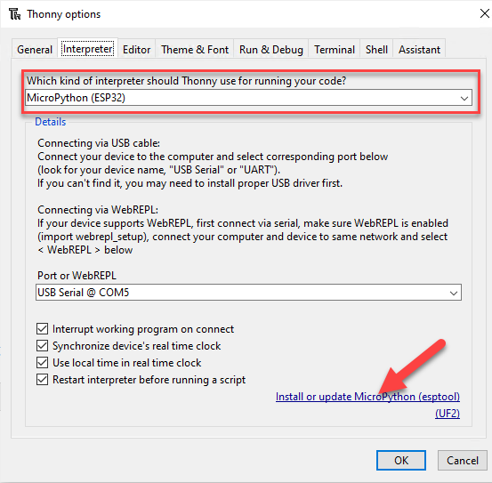
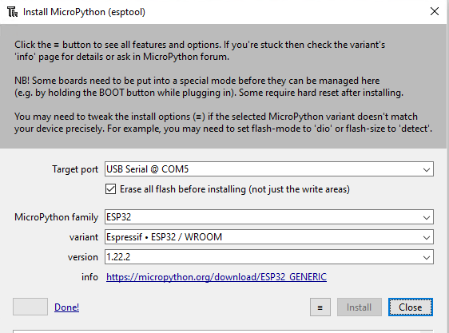
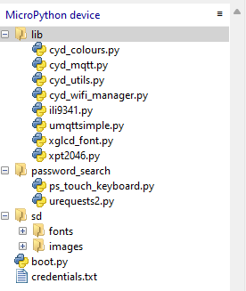

# upy-CYD01

Cheap Yellow Display examples using micropython

Many thanks to Brian Lough for getting all the basics prepared:
https://github.com/witnessmenow/ESP32-Cheap-Yellow-Display

The majority of the examples are modified versions of demos from here:
https://github.com/rdagger/micropython-ili9341/tree/master

## Getting Started

### Thonny setup
I used the latest version of Thonny https://thonny.org/

Download the latest version of micropython from here https://micropython.org/download/ESP32_GENERIC/ and install it using Thonny.
Here are the options I used:




In Thonny if the "lib" folder doesn't exist use Thonny to copy in the lib directory.  
If the "lib" folder is already present in your CYD then copy in these files:

- cyd_colours.py (colour definitions)
- cyd_mqtt.py (mqtt class)
- cyd_utils.py (set of CYD utilities)
- cyd_wifi_manager (wifi connection class)
- ili9341.py (the drivers for CYD)
- umqttsimple.py (mqtt driver)
- xglcd_font.py (font drivers)
- xpt2046.py (touch screen drivers for CYD)

### SD card set up

My demos assume you have an SD card installed in your CYD.  
Copy the sd folder containing fonts and images onto the SD card.

### Running the demos

I found the easiest way to run the demos was from the "this computer" window on Thonny.  
This avoids the need to download each one onto the CYD.

### Password Search demo
This demo is used to test passwords.  
It uses a REST API designed to let people know if their online accounts have been hacked.  
The code for this demo has been based on the examples here:  
https://github.com/rdagger/micropython-ili9341/tree/master  

Here is a link to a complete description of the original project  
https://www.rototron.info/projects/esp32-pwned-password-checker/

#### Password Search demo set up notes
Copy the password_search directory to CYD.  
Create a wifi credentials text file in the root directory called credentials.txt  
The format for credentials is:  
```
ssid_1,password1  
ssid_2,password2
```
### MQTT demo
### umqttsimple library
The umqttsimple library code was copied in from here:
https://raw.githubusercontent.com/RuiSantosdotme/ESP-MicroPython/master/code/MQTT/umqttsimple.py

#### MQTT testing
I used this public MQTT broker during testing:  
https://www.hivemq.com/mqtt/public-mqtt-broker/

and this browser based MQTT client to test the demo:  
https://www.hivemq.com/demos/websocket-client/

#### MQTT demo topics and messages
The topics are:
* cyd_topic/cmd
* cyd_topic/status  

The command (cmd) messages are:
* "0" to request status information
* "1" to turn off the Led
* "2" to turn on the led Red
* "3" to turn on the led Green
* "4" to turn on the led Blue  

The status request "0" will publish the current state of the Led to topic cyd_topic/status  
e.g. if the Led is RED it will return the value "2"

### CYD folder structure

Your folder structure should look like this:



## Implementation notes

### Touch screen

This is the original SPI for the touch screen:

`touch_spi = SPI(2, baudrate=1000000, sck=Pin(25), mosi=Pin(32), miso=Pin(39))`

to get touch and display working at same time you need to use SPI(1, and SPI(2,...  
but this causes a conflict with SDcard using slot=2

I found that using SoftSPI for touch appears to resolve this problem!

`touch_spi = SoftSPI(baudrate=100000, polarity=1, phase=0, sck=Pin(25), mosi=Pin(32), miso=Pin(39))`
`touch = Touch(touch_spi, cs=Pin(33), int_pin=Pin(36), int_handler=callback)`

### SD card

SD card must be formatted with a file system recognised by ESP32 (FAT)
